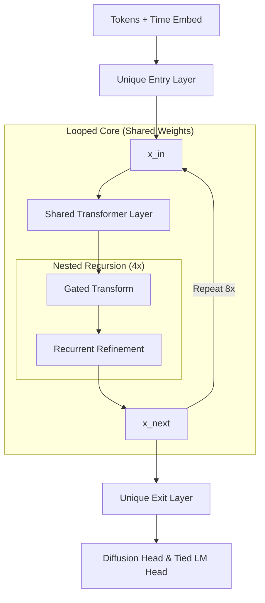

# CRUX: Nested Recursive Discrete Diffusion

CRUX is a parameter-efficient (27M params) Looped text generation Transformer using Discrete Diffusion. It utilizes nested weight sharing where an outer loop of shared transformer layers contains an inner loop of gated recursive processing. 

Two versions of CRUX were built: The CRUX-Heavy only uses the inner loop and disables outer weight sharing (36M params), while CRUX-Light uses the nested loop structure (27M params). CRUX-Light attains the same performance as CRUX-Heavy, but with ~23% fewer weights.

## Key Innovations (Light)

- **Looped Sandwich Architecture**: Features distinct "Entry" and "Exit" layers surrounding a core "Shared Middle" block that is executed 8 times per forward pass.
- **Nested Gated Recursion**: Each shared middle block itself contains an internal 4-step recursive loop, providing further computational depth (32 effective refinement steps) with minimal parameter overhead.
- **Discrete Diffusion Training**: Predicts clean tokens from masked/noisy states using an SNR-based schedule, providing a fast, non-autoregressive generation alternative.
- **Optimization**: Integrates Muon with Cautious Weight Decay for stable training.

| Feature              | 36M "Heavy" Model<br>(model_heavy.py)                                                                        | 27M "Light" Model (model.py)                                                                                                         |
| -------------------- | ------------------------------------------------------------------------------------------------------------ | ------------------------------------------------------------------------------------------------------------------------------------ |
| **Global Structure** | 10 unique, sequential Transformer layers                                                                     | Three distinct stages: Entry, Shared Middle, and Exit                                                                                |
| **Weight Sharing**   | None in Transformer layers, only the internal Recursive Processing block is sharing with itself by recursion | Shared Middle layer is reused 8 times per forward pass                                                                               |
| **Recursion**        | Traversed once (4 inner recursive steps) at the midpoint                                                     | Called while nested inside every one of the middle loops (8 middle loops $\times$ 4 inner recursive steps = 32 recursion traversals) |



## Setup

```bash
git clone https://github.com/TheronAI/crux.git
cd crux
pip install -r requirements.txt
```

### Training

CRUX can be trained with "micro-datasets" to study scaling efficiency:

```bash
python src/train.py \
    --dataset Marcus2112/minipile_density-proportioned_pico \
    --num-steps 62500 \
    --batch-size 16 \
    --recursive-depth 4
```

Alternatively run `python src/train.py`, which will apply the `config.yaml`.

### Inference

Generate text with real-time denoising visualization:

```bash
python generate.py "My name is" --num-tokens 5
```

## Context & References

1. Xiao, G., Tian, Y., Chen, B., Han, S., & Lewis, M. (2023). *Efficient Streaming Language Models with Attention Sinks* (arXiv:2309.17453). [arXiv](https://arxiv.org/abs/2309.17453).
2. Takehi, R., Clavié, B., Lee, S., & Shakir, A. (2025). *Fantastic (small) Retrievers and How to Train Them: mxbai-edge-colbert-v0 Tech Report* (arXiv:2510.14880). [arXiv](https://arxiv.org/abs/2510.14880).
3. MK2112. (2025). *MiniPile Density Dataset Series, derived using the MiniCorpus Framework*. [GitHub](https://github.com/MK2112/minicorpus).
4. Zhang, A. L., Kraska, T., & Khattab, O. (2025). *Recursive Language Models* (arXiv:2512.24601). [arXiv](https://arxiv.org/abs/2512.24601).
5. von Rütte, D., Fluri, J., Pooladzandi, O., Schölkopf, B., Hofmann, T., & Orvieto, A. (2025). *Scaling Behavior of Discrete Diffusion Language Models* (arXiv:2512.10858). [arXiv](https://arxiv.org/abs/2512.10858).
6. Arriola, M., Gokaslan, A., Chiu, J. T., Yang, Z., Qi, Z., Han, J., ... & Kuleshov, V. (2025). *Block diffusion: Interpolating between autoregressive and diffusion language models* (arXiv:2503.09573). [arXiv](https://arxiv.org/abs/2503.09573).
7. Jordan, K. (2024). Muon: An optimizer for hidden layers in neural networks. [Keller Jordan Blog](https://kellerjordan.github.io/posts/muon/).

## Citation

```bibtex
@software{theron2026crux,
  author = {TheronAI},
  title = {CRUX: A Nested Recursive Language Model with Discrete Diffusion},
  year = {2026},
  url = {https://github.com/TheronAI/crux},
  version = {0.0.2},
  license = {MIT}
}
```